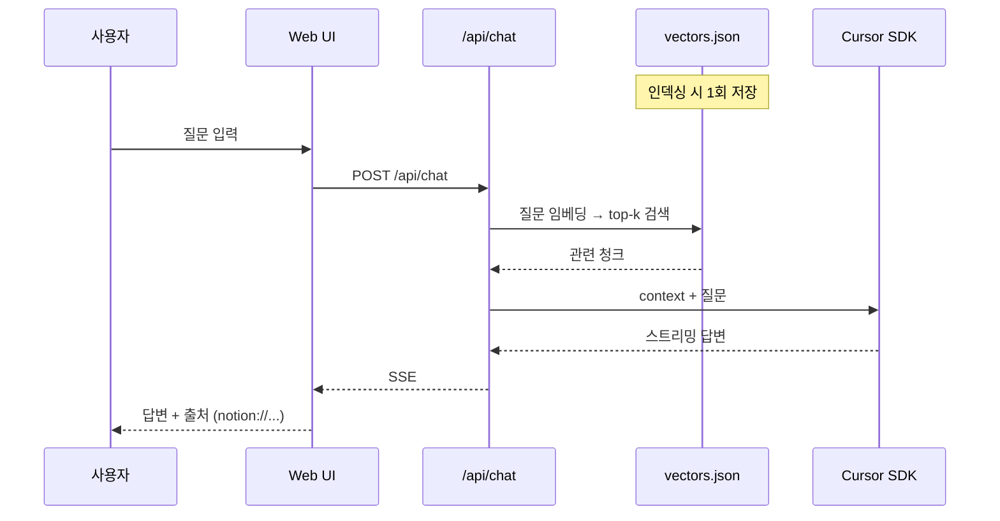
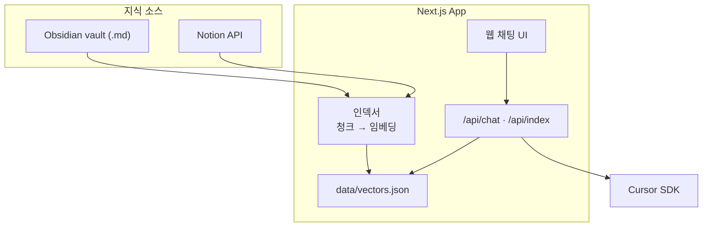

# Company Chat Bot

Obsidian vault + **Notion** 기반 RAG 회사 전용 챗봇.

회사 문서(`.md` vault 또는 Notion)를 인덱싱하고, 웹 UI에서 질문하면 관련 내용을 검색한 뒤 **Cursor SDK**로 답변을 생성합니다.

> **현재 단계:** MVP (로그인 없음, 로컬 실행)  
> **목표:** 전 직원 링크 공개 → 2차: 배포 + 웍스 SSO

---

## 빠른 시작 (Notion only)

```bash
npm install
cp .env.example .env.local
# .env.local 편집 (아래 참고)
npm run index    # 인덱싱 (CLI 권장, 2~5분)
npm run dev
```

1. `http://localhost:3000` 접속
2. `/api/health` 또는 UI에서 `chunkCount > 0` 확인
3. 채팅 테스트 (예: `2026-06-24 일일업무보고 알려줘`)

### 필수 설정 (Notion only 예시)

```bash
NOTION_API_KEY=ntn_...          # Integration Secret (mcp 등)
NOTION_PAGE_IDS=https://app.notion.com/p/{database-id}?v=...
NOTION_MAX_PAGES=500            # DB 행 수 상한 (기본 500)

CURSOR_API_KEY=crsr_...         # Cursor SDK
CURSOR_MODEL=composer-2.5
RAG_TOP_K=5
```

| 변수 | 필수 | 설명 |
|------|------|------|
| `CURSOR_API_KEY` | ✅ | [Cursor Settings](https://cursor.com/settings) → API Keys. **답변 생성 = Cursor 구독 크레딧** (별도 API 과금 아님) |
| `NOTION_API_KEY` | Notion 사용 시 | Integration Secret. Notion **문서 읽기**용 |
| `NOTION_PAGE_IDS` | 택1 | **페이지 URL** 또는 **DB URL** (`?v=` 뷰 ID는 무시됨) |
| `NOTION_MAX_PAGES` | 선택 | 인덱싱할 최대 Notion 페이지 수 (DB 행 포함). 기본 `500` |
| `VAULT_PATH` | 택1 | Obsidian vault 절대 경로 (Notion만 쓰면 생략) |

`VAULT_PATH` 또는 `NOTION_PAGE_IDS` 중 **하나 이상** 필요.

---

## 인덱싱

### CLI (권장)

```bash
npm run index
```

완료 시 터미널에 JSON 출력:

```json
{ "notionPageCount": 100, "chunkCount": 250, "indexedAt": "..." }
```

`chunkCount > 0`이면 성공. UI **Re-index** 버튼과 동일 (`POST /api/index`).

> 브라우저 Re-index는 인덱싱이 길면 타임아웃 날 수 있음 → **CLI 권장**  
> `/api/index`를 주소창에 열면 `GET` → **405** (POST만 지원)

### 언제 다시 인덱싱?

Notion 내용이 바뀌면 **수동 Re-index / `npm run index`** 필요. 실시간 동기화 없음.

### 소요 시간

- 첫 실행: 임베딩 모델 다운로드 **1~3분** 추가
- Notion DB ~100행: **2~5분**
- `VAULT_PATH`를 `Documents` 전체로 두면 **수십 분~** (비권장)

### Notion DB URL 권장

일일업무 Memo 같은 **테이블 DB**는 DB URL을 직접 넣는 것이 가장 빠릅니다:

```bash
NOTION_PAGE_IDS=https://app.notion.com/p/2fb1bb2bb3098039bb6afec45bf5355d
```

워크스페이스 **허브 페이지** URL을 넣으면 하위 페이지·DB까지 크롤하지만 `NOTION_MAX_PAGES` 한도에 걸릴 수 있습니다.

---

## RAG 플로우



**인덱싱** = Notion API → 텍스트 → 청크(~800자) → 로컬 임베딩 → `data/vectors.json`  
**채팅** = 질문 임베딩 → vectors.json 검색 → LLM 답변 (Notion API 재호출 없음)

### DB 행(테이블) 인덱싱

일일업무 Memo처럼 내용이 **페이지 본문이 아니라 DB 컬럼**(날짜, 담당자 rich_text)에 있으면, `properties-to-text`로 텍스트 변환 후 임베딩합니다.

### 질문 예시

```
2026-06-24 일일업무보고 알려줘
6월 24일 이희원 업무 뭐했어?
```

날짜(`2026-06-24`) + 키워드(`일일업무`, 담당자 이름)를 같이 넣으면 검색이 잘 됩니다.

---

## 아키텍처



| 영역 | 기술 |
|------|------|
| Framework | Next.js 16 (App Router) |
| 지식 소스 | Obsidian vault (`.md`) + Notion 페이지/DB |
| 검색 | RAG — 로컬 임베딩 (`Xenova/all-MiniLM-L6-v2`) + JSON 벡터 스토어 |
| LLM | Cursor SDK (`@cursor/sdk`) |
| UI | 웹 채팅 (SSE 스트리밍) |

---

## Notion 연동

### 1. Integration 생성

1. [notion.so/profile/integrations](https://www.notion.so/profile/integrations) → **New integration**
2. 워크스페이스 선택 → Secret 복사 (`secret_...` 또는 `ntn_...`)
3. `.env.local` → `NOTION_API_KEY=...`

### 2. 페이지/DB 연결 (필수)

Integration만 만들면 API 접근 불가. **읽을 페이지·DB마다** 연결:

1. 대상 페이지 또는 DB 열기
2. **⋯** → **연결** → integration 선택 (예: mcp)

### 3. NOTION_PAGE_IDS

- **DB URL** (`/p/{32hex}`) — 테이블 DB 직접 인덱싱 (권장)
- **페이지 URL** — 하위 `child_page` / `child_database` 재귀 크롤
- `?v=` 쿼리의 뷰 ID는 **무시**되고 path의 DB/페이지 ID만 사용

---

## Obsidian vault 연동 (선택)

```bash
VAULT_PATH=/Users/you/Documents/company-wiki
```

Notion만 쓸 때는 `VAULT_PATH` 주석 처리. vault에 Notion 링크를 적어도 봇이 자동으로 읽지 않음 — `NOTION_PAGE_IDS`로 설정.

---

## 환경변수 전체

```bash
# 지식 소스 (택1 이상)
VAULT_PATH=/path/to/vault
NOTION_API_KEY=ntn_...
NOTION_PAGE_IDS=https://app.notion.com/p/...
NOTION_MAX_PAGES=500

# LLM (필수)
CURSOR_API_KEY=crsr_...
CURSOR_MODEL=composer-2.5

# RAG (선택)
RAG_TOP_K=5
INDEX_INCLUDE=**/*.md
DATA_DIR=data
```

`.env.local`은 **Git에 커밋하지 마세요.**

---

## API

| Endpoint | Method | 설명 |
|----------|--------|------|
| `/api/chat` | POST | `{ message, history? }` → RAG + Cursor SDK 스트리밍 |
| `/api/index` | POST | vault + Notion 재인덱싱 |
| `/api/health` | GET | 설정·인덱스 상태 (`chunkCount`, `indexedAt`) |

---

## 프로젝트 구조

```
obsidian_chat_bot/
├── app/api/              # chat, index, health
├── lib/
│   ├── indexer/
│   ├── notion/           # fetch-pages, properties-to-text, client
│   ├── embeddings/
│   ├── vector-store/
│   ├── rag/
│   └── llm/
├── components/chat/
├── scripts/index-cli.ts  # npm run index
├── data/vectors.json     # gitignore
└── .env.local            # gitignore
```

---

## MVP vs 2차

### MVP (현재)

- 웹 채팅 UI
- Notion DB/페이지 인덱싱 (+ Obsidian vault 선택)
- RAG + Cursor SDK 답변 + 출처 표시
- `npm run index` / Re-index
- 로그인 없음 · localhost

### 2차

- Vercel/사내 서버 **배포**
- **웍스 SSO** 로그인
- 자동 재인덱싱 (cron)
- Slack, Obsidian 플러그인

---

## 과금 정리

| 항목 | 과금 |
|------|------|
| Notion API (문서 읽기) | Notion 플랜 범위, Cursor 과금 **아님** |
| Cursor SDK (답변 생성) | **Cursor 구독 크레딧** (IDE와 동일 풀) |
| 로컬 임베딩 | 무료 (모델 다운로드 1회) |

---

## 보안

| 커밋 금지 | 이유 |
|-----------|------|
| `.env.local` | API 키 |
| `data/` | 회사 문서 임베딩 |

---

## License

TBD
