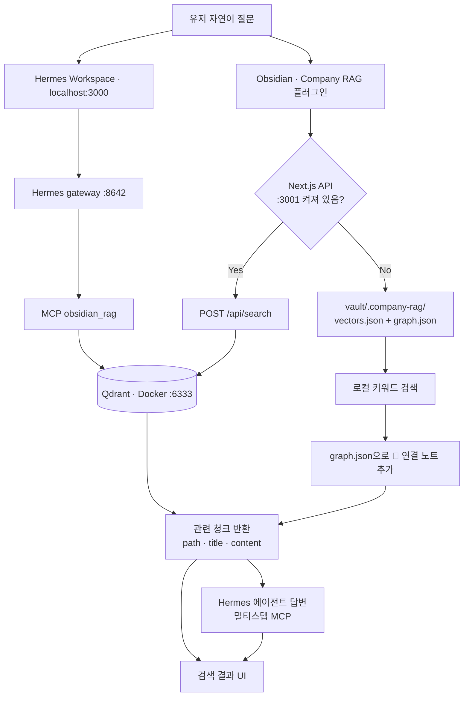
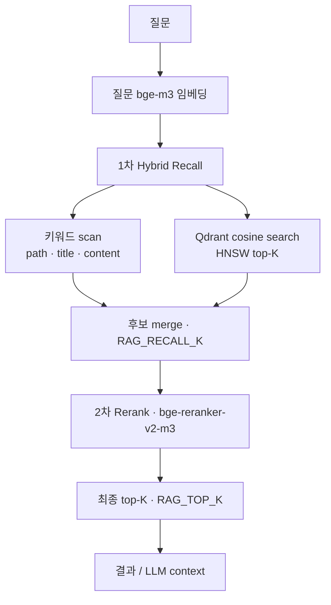
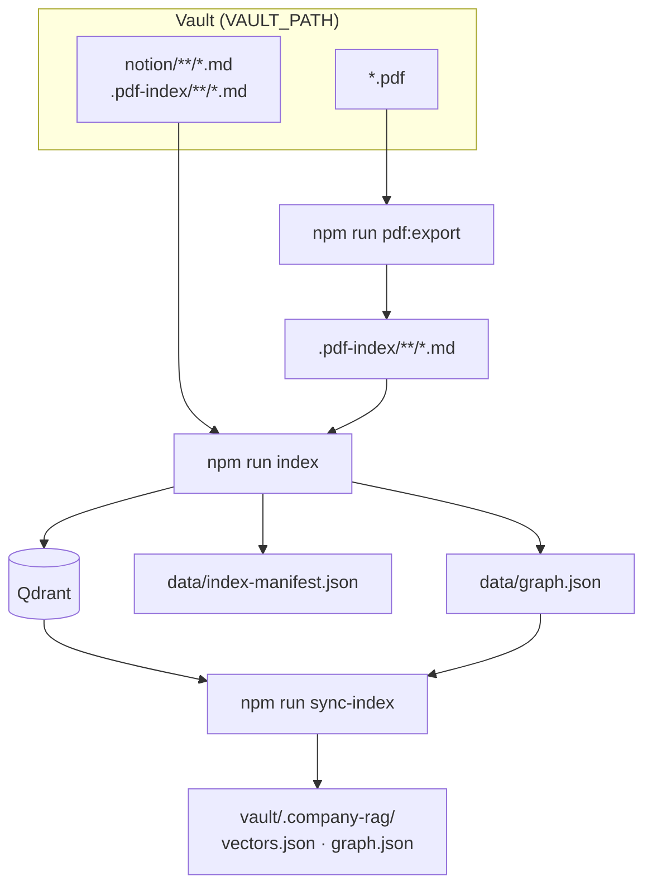
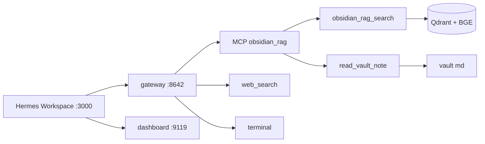

# Obsidian Chat Bot

Obsidian **vault 폴더** (`VAULT_PATH`) 안의 `.md`를 인덱싱해 **hybrid 검색 + rerank**합니다.

**웹 UI**는 [Hermes Workspace](https://github.com/outsourc-e/hermes-workspace) (`localhost:3000`) — Hermes 에이전트 + MCP 멀티스텝.  
**RAG 인프라**(인덱싱, Qdrant, MCP)는 이 레포가 담당합니다.

벡터 저장은 **Qdrant** (로컬 Docker). Obsidian **Company RAG** 플러그인은 `/api/search`로 검색하고, API가 꺼지면 vault `.company-rag/` offline fallback을 씁니다.

**v0.3** — **`Xenova/bge-m3`** 임베딩(1024차, multilingual) + Hybrid 검색(키워드 + 시맨틱) + **BGE rerank** 2단 retrieval. Qdrant payload에 `rootFolder` 포함.

**v0.2** — `vectors.json` 대신 Qdrant Search Engine 패턴 (HNSW cosine top-K).

---

## 구조

### 1. 유저 검색 (런타임)

인덱싱은 **이미 CLI에서 끝난 상태**입니다. 검색 시에는 vault md를 다시 읽지 않고 **Qdrant**(또는 offline JSON)에서 청크를 꺼냅니다.



| 경로 | 검색 방식 | 비고 |
|------|-----------|------|
| **온라인** (Obsidian / API) | Qdrant hybrid + rerank | 시맨틱(cosine) + 키워드 → rerank |
| **offline** (Obsidian만) | `vectors.json` 키워드 + `graph.json` 확장 | API 꺼져 있을 때 fallback |
| **웹 채팅** (Workspace :3000) | Hermes MCP 멀티스텝 → Qdrant | `obsidian_rag_search` + `read_vault_note` |
| **레거시 웹** (`npm run dev` :3001) | Qdrant → Cursor SDK 1-shot | `/api/chat` |

> vault **원본 md 전체**는 Qdrant에 없습니다. **청크 조각**(`content`, `path`, `title` …) + **1024차원 벡터**만 저장됩니다.

### 2. 검색 파이프라인 상세 (온라인)



| 단계 | 역할 |
|------|------|
| **1차 Hybrid** | 의미(시맨틱) + 정확한 단어(키워드)로 후보 **넓게** 수집 |
| **2차 Rerank** | cross-encoder가 query+청크 쌍을 읽고 **순위 재정렬** |
| **Generation** (`/api/chat`) | rerank된 청크를 context로 Cursor SDK 답변 |

### 3. 인덱싱 (CLI — 미리 해두는 작업)



| 명령 | 역할 |
|------|------|
| `npm run pdf:export` | PDF → `.pdf-index/**/*.md` sidecar (Java 11+, [OpenDataLoader](https://github.com/opendataloader-project/opendataloader-pdf)) |
| `npm run index` | md → 청킹 → bge-m3 임베딩 → **Qdrant** + graph (기본 **증분**) |
| `npm run sync-index` | Qdrant + graph → vault `.company-rag/` (Obsidian offline용) |
| `npm run build-graph` | wikilink 그래프만 재빌드 (임베딩 없음) |

### 4. 저장소 한눈에

| 저장 | 위치 | 내용 | 검색 시 |
|------|------|------|---------|
| **Qdrant** | Docker `:6333` | 청크 벡터 + payload | **온라인 검색 본체** |
| **vectors.json** | `vault/.company-rag/` | Qdrant 전체 스냅샷 (청크 + embedding) | API offline fallback |
| **graph.json** | `data/` + `.company-rag/` | md 간 wikilink / notion_link | 🔗 연결 노트 확장 |
| **index-manifest.json** | `data/` | mtime/size/qdrantPaths (증분용) | 검색 안 씀 (index만) |
| **vector-meta.json** | `data/` | `indexedAt`, `chunkCount` | 메타만 |

**vectors.json** — 청크 + 1024차원 embedding 배열:

```json
{
  "meta": { "indexedAt": "...", "chunkCount": 2635 },
  "chunks": [{ "path": "notion/foo.md", "title": "...", "content": "...", "embedding": [0.02, ...] }]
}
```

**graph.json** — 노트 간 링크:

```json
{
  "meta": { "nodeCount": 519, "edgeCount": 4 },
  "nodes": ["notion/A.md", "notion/B.md"],
  "edges": [{ "from": "notion/A.md", "to": "notion/B.md", "kind": "notion_link" }]
}
```

### 5. 구성 요약

| 구성 | 역할 |
|------|------|
| vault md (`INDEX_INCLUDE`) | 인덱싱 대상 (예: `notion/**/*.md`) |
| **Company RAG 플러그인** | Obsidian 사이드바 Lookup · `/api/search` |
| **Hermes Workspace** (`npm run workspace:dev`) | 메인 웹 UI · `:3000` |
| **Next.js** (`npm run dev`) | 레거시 API · `/api/search`, `/api/chat` · `:3001` |
| **Qdrant** (Docker) | 벡터 DB · cosine HNSW 검색 |
| **Hermes Agent** | gateway `:8642` + dashboard `:9119` + MCP |

---

## Hermes Agent + Workspace

[Hermes Agent](https://github.com/nousresearch/hermes-agent)가 **에이전트 두뇌**, [Hermes Workspace](https://github.com/outsourc-e/hermes-workspace)가 **웹 UI**입니다. 같은 Qdrant 인덱스를 MCP로 멀티스텝 검색합니다.



| 경로 | LLM | 검색 | vault 전문 | 웹 / 터미널 |
|------|-----|------|------------|-------------|
| **Workspace** (`npm run workspace:dev`) | Nous Portal | MCP **멀티스텝** + `session_search` | `read_vault_note` | ✅ |
| **Hermes CLI** (`npm run hermes:chat`) | Nous Portal | 동일 MCP | `read_vault_note` | ✅ |
| **레거시 Next** (`npm run dev` :3001) | Cursor SDK | 1회 hybrid+rerank | 청크만 | 없음 |

### 사전 요구

1. [Hermes 설치](https://hermes-agent.nousresearch.com/) (Nous Portal OAuth 권장)
2. Qdrant 실행 + 인덱스 (`npm run qdrant:up`, `npm run index`)
3. Node.js 22+ (Workspace용)

### 최초 1회

```bash
npm run hermes:setup      # ~/.hermes MCP + api_server toolsets
npm run workspace:setup   # ~/hermes-workspace 클론 + .env 연결
```

### 매일 사용 (터미널 3~4개)

```bash
npm run qdrant:up           # Docker Qdrant (한 번)
npm run hermes:gateway      # :8642 — 에이전트 API
npm run hermes:dashboard    # :9119 — 세션·스킬 API
npm run workspace:dev       # :3000 — 웹 UI ← 여기서 채팅
```

문서 변경 후: `npm run index`

상세: [`hermes/WORKSPACE.md`](hermes/WORKSPACE.md)

### 연동 (CLI만 쓸 때)

```bash
npm run hermes:setup
npm run hermes:chat     # web + terminal + mcp-obsidian_rag + session_search
```

`hermes:setup`은 `hermes/config.fragment.yaml`을 읽어 `mcp_servers.obsidian_rag`와 `platform_toolsets`를 `~/.hermes/config.yaml`에 넣습니다.

### MCP 도구

| 도구 | 역할 |
|------|------|
| `obsidian_rag_search` | hybrid + rerank 검색 (`retrieveRelevantChunksWithMeta`와 동일 파이프라인) |
| `read_vault_note` | vault 상대 경로로 md **전문** 읽기 (요약용) |
| `prepare_share` | 네이버웍스 DM 초안 작성 (**전송 안 함**). `config/share-people.json`으로 수신자 해석 |
| `confirm_share_draft` | 사용자가 `보내` 등 명시 확인한 뒤에만 초안 전송 (`data/share-log.jsonl`에 감사 로그 append) |
| `cancel_share_draft` | 초안 취소 |

Hermes **과거 대화**는 별도 DB(`~/.hermes/state.db`)에 자동 저장되며, `session_search`로 검색합니다 (Qdrant/vault index와 무관).

MCP 서버만 단독 실행: `npm run mcp` (stdio, Hermes가 subprocess로 기동)

### NAVER Works DM 공유

문서 요약을 **개인 네이버웍스 DM**으로 보낼 수 있습니다. Slack은 쓰지 않습니다. Hermes가 초안을 보여준 뒤, 사용자가 확인할 때만 전송합니다.

1. [Developer Console](https://developers.worksmobile.com/)에서 Client App + Bot + Service Account JWT
2. Scope: `bot`, `bot.message`, `bot.read`, `directory.read`
3. `.env.local`에 `NAVER_WORKS_*` 설정 (`.env.example` 참고)
4. `npm run works:sync-people` → Works 멤버를 `config/share-people.json`에 채움 (`directory.read`)
5. Workspace에서: `A씨에게 … 요약 보내줘` → 초안 확인 → `보내`

상세: [`hermes/WORKSPACE.md`](hermes/WORKSPACE.md) · 에이전트 규칙: [`hermes/AGENTS.md`](hermes/AGENTS.md)

매일 기동을 한 번에: `npm run start:all` (gateway + dashboard + Workspace)

### 비용 참고

| 항목 | Nous 과금 |
|------|-----------|
| `obsidian_rag_search` / `read_vault_note` | 없음 (로컬 Qdrant + BGE) |
| `terminal` (local) | 없음 |
| LLM 턴 | 모델별 (설치 시 `*:free` 모델 선택 가능) |
| `web_search` / `web_extract` | Nous hosted tool — **호출마다** 과금 가능 (Firecrawl gateway) |

에이전트 지침: `hermes/AGENTS.md` → `npm run hermes:setup` 시 `~/.hermes/AGENTS.md`로 복사

---

## Vault 구조

```
{VAULT_PATH}/
├── notion/              # 회사 문서 md (INDEX_INCLUDE 대상)
├── *.pdf                # PDF 원본 (PDF_INCLUDE)
├── .pdf-index/          # pdf:export → 검색용 sidecar md
├── .company-rag/        # npm run sync-index → vectors.json, graph.json
└── .obsidian/plugins/company-rag/   # Obsidian 플러그인
```

---

## 설정

```bash
cp .env.example .env.local
```

| 변수 | 설명 |
|------|------|
| `VAULT_PATH` | Obsidian vault 절대 경로 |
| `INDEX_INCLUDE` | 인덱싱 glob (예: `notion/**/*.md,vogopang_front/**/*.md`) |
| `HERMES_API_KEY` | Hermes gateway API 토큰 (`workspace:setup`이 `~/hermes-workspace/.env`에 복사) |
| `CURSOR_API_KEY` | 레거시 Next 채팅용 (`npm run dev` :3001) |
| `NAVER_WORKS_CLIENT_ID` / `CLIENT_SECRET` | Works Client App 인증 |
| `NAVER_WORKS_SERVICE_ACCOUNT` | Service Account 이메일 |
| `NAVER_WORKS_BOT_ID` | Bot ID |
| `NAVER_WORKS_PRIVATE_KEY_PATH` | Service Account private key 절대 경로 (또는 `NAVER_WORKS_PRIVATE_KEY`) |
| `NAVER_WORKS_SCOPE` | 기본 `bot bot.message bot.read directory.read` |
| `SHARE_PEOPLE_FILE` | 수신자 디렉터리 JSON (기본 `config/share-people.json`) |
| `RAG_INDEX_DIR` | vault 내 인덱스 폴더 (기본 `.company-rag`) |
| `QDRANT_URL` | Qdrant REST URL (기본 `http://127.0.0.1:6333`) |
| `QDRANT_COLLECTION` | Qdrant 컬렉션 (기본 `company-rag`) |
| `RAG_TOP_K` | rerank **후** LLM·API에 넘길 최종 청크 수 |
| `RAG_RECALL_K` | hybrid **1차** 후보 풀 크기 (기본 `50`) |
| `EMBEDDING_MODEL` | bi-encoder (기본 `Xenova/bge-m3`, **1024차원**). 변경 시 `npm run index` 재실행 |
| `EMBED_BATCH_SIZE` | 임베딩 배치 크기 (기본 `8`, 선택) |
| `RERANK_ENABLED` | cross-encoder rerank 사용 (`true` / `false`) |
| `RERANK_MODEL` | rerank ONNX 모델 (기본 `woxpas-ai/bge-reranker-v2-m3-onnx`) |
| `RERANK_BATCH_SIZE` | rerank 배치 크기 (기본 `8`) |
| `RERANK_MIN_SCORE` | rerank **관련성 하한** (raw logit, 기본 `0`). 미만 청크는 검색 결과에서 제외 |
| `PDF_INCLUDE` | export 대상 PDF glob (기본 `**/*.pdf`) |
| `PDF_INDEX_DIR` | sidecar md 저장 폴더 (기본 `.pdf-index`). `npm run index`에 자동 포함 |
| `PDF_HYBRID` | 스캔 PDF OCR 시 `docling-fast` (hybrid 서버 필요) |
| `PDF_HYBRID_URL` | hybrid OCR 서버 URL (기본 `http://127.0.0.1:5002`) |
| `PDF_HYBRID_MODE` | 이미지 PDF OCR 모드 (기본 `full`) |

---

## PDF 검색 + Obsidian READ

텍스트 PDF는 **OpenDataLoader**로 md sidecar를 만들고, 기존 **bge-m3 + rerank** 파이프로 검색합니다.  
**이미지/스캔 PDF**는 hybrid OCR(`odp-hybrid` Docker)이 페이지 안 **글자를 추출** → sidecar md → **텍스트만** 임베딩합니다 (vision 임베딩 아님).  
검색 결과 `path`는 **원본 PDF**를 가리키며, `pageNumber`가 있으면 Obsidian PDF++에서 `#page=N`으로 열 수 있습니다.

```bash
# Java 11+ 필요: java -version
npm run pdf:hybrid:up   # 스캔 PDF OCR 서버 (최초 1회, :5002)
npm run pdf:export      # vault PDF → .pdf-index/**/*.md
npm run index           # sidecar + notion md 함께 인덱싱 (기본 증분)
```

이미지 → PDF 테스트 예:

```bash
# png/jpeg/gif → PDF (macOS sips)
sips -s format pdf image.png --out test_pdf/doc.pdf
npm run pdf:export && npm run index
```

| 단계 | 도구 |
|------|------|
| PDF → 텍스트 | `@opendataloader/pdf` (local) |
| 스캔 PDF OCR | `npm run pdf:hybrid:up` → `PDF_HYBRID=docling-fast` · `PDF_HYBRID_URL` |
| 검색 | bge-m3 · Qdrant · bge-reranker (Notion과 동일) |
| 화면 READ | Obsidian PDF++ (`[[file.pdf#page=5]]`) |

Sidecar / Qdrant에 들어간 **텍스트 확인**:

```bash
# OCR sidecar 원문
cat {VAULT_PATH}/.pdf-index/test_pdf/논문_test_004.pdf.md

# Qdrant payload (임베딩된 청크 본문)
curl -s http://127.0.0.1:6333/collections/company-rag/points/scroll \
  -H 'Content-Type: application/json' \
  -d '{"filter":{"must":[{"key":"path","match":{"value":"test_pdf/논문_test_004.pdf"}}]},"limit":5,"with_payload":true}' \
  | python3 -c "import sys,json; [print(p['payload'].get('content','')) for p in json.load(sys.stdin)['result']['points']]"
```

Sidecar frontmatter 예:

```yaml
---
title: "보고서"
source_pdf: documents/report.pdf
source_type: pdf
---
```

---

## 사용

```bash
npm install

npm run qdrant:up    # Qdrant Docker (최초 1회)
npm run index        # 기본 증분; 전체 재인덱싱: npm run index -- --full
npm run sync-index   # .company-rag/ 로 offline 스냅샷 export

# ── 메인 UI (Hermes Workspace) ──
npm run hermes:setup       # 최초 1회
npm run workspace:setup    # 최초 1회
npm run hermes:gateway     # :8642
npm run hermes:dashboard   # :9119
npm run workspace:dev      # http://localhost:3000

# ── 레거시 Next RAG UI ──
npm run dev                # http://localhost:3001
```

md 추가·수정 후 `npm run index` → `npm run sync-index` 를 다시 실행합니다. 기본은 **증분 인덱싱**(`data/index-manifest.json`으로 mtime/size 비교)이며, 변경·추가·삭제된 md만 임베딩합니다. `npm run index -- --full`로 전체 재인덱싱할 수 있습니다.

### Qdrant (로컬 Docker)

```bash
npm run qdrant:up     # http://127.0.0.1:6333
npm run qdrant:down
```

| 변수 | 기본값 | 설명 |
|------|--------|------|
| `QDRANT_URL` | `http://127.0.0.1:6333` | Qdrant REST API |
| `QDRANT_COLLECTION` | `company-rag` | 컬렉션 이름 |

벡터·청크 본문은 Qdrant에 저장됩니다. `data/vector-meta.json`에는 `indexedAt`, `chunkCount`만 둡니다.

**대시보드:** [http://localhost:6333/dashboard](http://localhost:6333/dashboard) · 컬렉션 `company-rag`

**초기 풀 인덱스**는 로컬 embed(`Xenova/bge-m3`)가 병목입니다. vault 전체(`**/*.md`, 수천 파일)면 **수 시간** 걸릴 수 있습니다. Qdrant upsert는 임베딩이 끝난 뒤 배치로 진행됩니다.

> **`EMBEDDING_MODEL` 또는 차원을 바꾼 뒤에는 `npm run index -- --full`로 전체 재인덱싱**해야 합니다. Qdrant 컬렉션이 새 차원으로 다시 만들어집니다.

증분 인덱싱은 `data/index-manifest.json`에 파일별 `mtimeMs`, `size`, Qdrant `path` 스냅샷을 저장합니다. PDF sidecar는 Qdrant에 `source_pdf` 경로로 저장되므로 manifest에도 해당 경로를 추적합니다. 그래프는 매 실행 시 전체 md를 읽어 갱신하지만 임베딩은 변경 파일만 수행합니다.

---

## 인덱싱 기준

### 증분 인덱싱 (v0.3+)

`npm run index` 기본값은 **증분**입니다. `data/index-manifest.json`에 파일별 `mtimeMs`, `size`, `chunkCount`, Qdrant `path` 스냅샷을 두고 diff합니다.

| diff | 동작 |
|------|------|
| added / modified | 해당 md만 청킹 + 임베딩 → Qdrant patch |
| deleted | manifest의 `qdrantPaths`로 Qdrant delete |
| unchanged | 스킵 (임베딩 없음) |

전체 재인덱싱이 필요한 경우:

- 최초 실행 (manifest 없음)
- `EMBEDDING_MODEL` / 차원 변경
- `npm run index -- --full`

PDF sidecar는 Qdrant `path`가 **`source_pdf`** (원본 PDF 경로)이므로 manifest도 sidecar md 키 + `qdrantPaths: [source_pdf]` 형태로 추적합니다. 그래프는 매 실행 시 전체 md를 읽어 갱신하지만 **임베딩은 변경 파일만** 수행합니다.

### 어떤 파일이 대상인가

`{VAULT_PATH}` 아래에서 **`INDEX_INCLUDE` glob**에 맞는 `.md`만 인덱싱합니다.

```bash
# 권장 — 회사 문서만
INDEX_INCLUDE=notion/**/*.md

# vault 전체 (md 수천 개 → 수 시간 걸릴 수 있음)
INDEX_INCLUDE=**/*.md
```

**자동 제외** (`lib/indexer/scan.ts`):

- `node_modules/`, `.git/`, `.obsidian/`, `.trash/`

### 어떻게 잘라서 저장하나 (청킹)

검색 단위는 **파일 1개가 아니라 청크 1개**입니다. `npm run index` 시 아래 순서로 처리되고, Qdrant `company-rag` 컬렉션에 저장됩니다.

```
원본 .md
  → ① frontmatter 분리 + title 추출
  → ② 전처리 (cleanMarkdownForChunk)
  → ③ # 헤딩 기준 섹션 분리
  → ④ 섹션 본문이 800자 초과 시 overlap 120으로 분할
  → ⑤ content/title 조립
  → ⑥ content 임베딩 (1024차원)
  → Qdrant (vector + payload)
```

구현: `lib/indexer/preprocess.ts` (전처리) · `lib/indexer/chunk.ts` (청킹)

#### 규칙 요약

| 규칙 | 값 |
|------|-----|
| 문서 제목 | frontmatter `title:` → 없으면 첫 `#` → 없으면 파일명 |
| 섹션 분리 | `#`로 시작하는 줄 = 새 섹션 (`##`, `###` 포함) |
| `#` 없는 본문 | 문서 제목을 섹션 제목으로 사용 |
| 최대 청크 크기 | **800자** (섹션 **본문** 기준) |
| 겹침 (overlap) | **120자** (800자 초과 섹션을 여러 청크로 자를 때만) |
| 분할 방식 | 문단/문장이 아니라 **글자 수** 기준 기계적 슬라이스 |
| 임베딩 대상 | payload **`content`** 전체 (`Xenova/bge-m3`, 1024차원) |
| 청크 `content` | `# 문서제목`(섹션과 다를 때) + `# 섹션제목` + 본문 조각 |
| payload `title` | `문서제목 — 섹션제목` (같으면 섹션만) |
| 전처리 후 본문 없음 | 해당 파일 **청크 0개** (인덱스에서 스킵) |

#### 전처리 (`cleanMarkdownForChunk`)

인덱싱 시 **1회** 적용. 검색 시에는 다시 돌리지 않습니다.

| 처리 | 내용 |
|------|------|
| Notion 코드펜스 | ` ```javascript ` 등 **펜스 라인만** 제거 (안의 본문은 유지) |
| HTML | `<empty-block/>`, `<table>` 등 태그 제거 |
| 이미지 | `` → `[image]` |
| 링크 | `[텍스트](url)` → 텍스트만 |
| URL | 긴 `https://...` 제거 |

> Notion export는 회의 본문을 ` ```javascript ` 블록으로 감싸는 경우가 많습니다. 펜스를 그대로 두면 임베딩이 코드로 오염되고, `# 구분` / `# 이름` 같은 짧은 메타 섹션이 본문보다 검색 상위에 뜰 수 있습니다.

#### 섹션·청크 예시 (정기미팅)

`notion/11월 10일 정기미팅 (2a61bb2b).md` 같은 노션 문서:

| 섹션 | 내용 | 결과 |
|------|------|------|
| (제목 섹션) | `[플랫폼본부]`, 푸딩툰 65%, 픽미툰… | **본문 청크** (길면 800자 단위로 여러 개) |
| `# 구분` | `정기` | 짧은 메타 청크 |
| `# 이름` | `11월 10일 정기미팅` | 짧은 메타 청크 |

임베딩되는 `content` 예:

```markdown
# 11월 10일 정기미팅

[플랫폼본부]

--- 지난주 업무 진행 상황 ---

[푸딩툰 리뉴얼]
- 작업 목표 진행율 : 65%(목표:70%)
...
```

#### Qdrant 포인트 1개 = 청크 1개

| 필드 | 설명 |
|------|------|
| **vector** | `content` 임베딩 (1024차원, cosine) |
| `path` | vault 기준 상대경로 (예: `notion/foo.md`) |
| `title` | UI·키워드 검색용 |
| `content` | 임베딩·리랭크·채팅 스니펫에 사용하는 전체 텍스트 |
| `startLine` | 원본 md에서 해당 섹션 시작 줄 (대략) |
| `rootFolder` | 경로 첫 segment (예: `notion`) |
| `id` | `sha256(path:index:content앞64자)` 16자 |

**원본 md 파일 전체는 Qdrant에 저장되지 않습니다.** 검색으로 `path` + `startLine`만 알 수 있고, 전문이 필요하면 vault에서 해당 md를 직접 열어야 합니다.

청킹·전처리 규칙을 바꾼 뒤에는 **`npm run index`를 다시 실행**해야 Qdrant에 반영됩니다.

파일 1개가 여러 청크가 될 수 있습니다. 검색·유사도는 **파일 단위가 아니라 청크 단위**입니다.

### 무엇이 저장되나

| 출력 | 내용 |
|------|------|
| **Qdrant** `company-rag` | 청크 텍스트 + 임베딩 벡터 + payload (`path`, `title`, `content`, `startLine`, `rootFolder`) |
| `data/vector-meta.json` | 인덱스 메타 (`indexedAt`, `chunkCount`) |
| `data/index-manifest.json` | 증분 인덱싱 스냅샷 (mtime/size/qdrantPaths) |
| `graph.json` | 같은 md들의 `[[wikilink]]` 노드·엣지 |

`npm run index`는 **vectors + graph** 둘 다 갱신합니다. `npm run build-graph`는 wikilink 그래프만 다시 빌드합니다.

---

## Obsidian 플러그인 (Company RAG)

```bash
cd obsidian-plugin && npm install && npm run build

mkdir -p {VAULT_PATH}/.obsidian/plugins
ln -sf /path/to/obsidian_chat_bot/obsidian-plugin {VAULT_PATH}/.obsidian/plugins/company-rag

npm run sync-index
npm run dev    # 시멘틱 검색 API
```

Obsidian → Community plugins → **Company RAG** ON → 리본 🔍

- 유사도 **%** + **🔗 연결** (wikilink 이웃)
- **노트 열기** → vault md 이동

---

## 기술 스택

### 앱

| 기술 | 용도 |
|------|------|
| [Next.js 16](https://nextjs.org/) | 웹 UI + API Route (`/api/chat`, `/api/search`) |
| [React 19](https://react.dev/) | 채팅 UI |
| [TypeScript](https://www.typescriptlang.org/) | 앱·플러그인·CLI |
| [Tailwind CSS 4](https://tailwindcss.com/) | 웹 스타일 |
| [SSE](https://developer.mozilla.org/en-US/docs/Web/API/Server-sent_events) | `/api/chat` 스트리밍 답변 |

### RAG (Retrieval-Augmented Generation)

질문 → **hybrid recall** → **rerank** → 관련 md 조각 → LLM에 context로 붙여 답변.

| 단계 | 구현 | 모델 / 저장 |
|------|------|-------------|
| Chunking | `lib/indexer/chunk.ts`, `preprocess.ts` | 전처리 → `#` 섹션 → 800자/overlap 120 → `content` 임베딩 |
| Embedding | `lib/embeddings/local.ts` | **[Xenova/bge-m3](https://huggingface.co/Xenova/bge-m3)** · **1024차원** · `@xenova/transformers` bi-encoder (`EMBEDDING_MODEL`) |
| 1차 Hybrid | `lib/rag/query-hints.ts` · `lib/rag/hybrid.ts` | 키워드 + Qdrant 시맨틱 → merge `RAG_RECALL_K` |
| 2차 Rerank | `lib/rerank/local.ts` | **`BAAI/bge-reranker-v2-m3`** cross-encoder · `RERANK_MIN_SCORE` 미만 제외 |
| Graph expand | `lib/graph/` · `lib/rag/graph-expand.ts` | rerank **비활성** 시 wikilink 1-hop (기본은 rerank 우선) |
| Generation | `@cursor/sdk` · `CURSOR_MODEL` | context + 질문 → LLM 스트리밍 (기본 `composer-2.5`) |

#### 사용 모델 요약

| 용도 | Hugging Face / 설정 | 비고 |
|------|---------------------|------|
| 인덱싱·시맨틱 검색 | [Xenova/bge-m3](https://huggingface.co/Xenova/bge-m3) | `@xenova/transformers`, 1024-dim cosine, `EMBEDDING_MODEL` |
| Rerank | [BAAI/bge-reranker-v2-m3](https://huggingface.co/BAAI/bge-reranker-v2-m3) | ONNX via `RERANK_MODEL`, query+passage 쌍 scoring |
| 채팅 LLM | Cursor SDK (`CURSOR_MODEL`) | API key 필요 |

> Embedding(bge-m3) **첫 로드** 시 `@xenova/transformers` 가중치 다운로드(~2.2GB), Rerank **첫 로드** 시 ONNX(~500MB)로 수 분 걸릴 수 있습니다.

### 저장소

| 저장 | 내용 |
|------|------|
| **Qdrant** (Docker) | 청크 + embedding (시멘틱 검색) |
| `data/vector-meta.json` | 인덱스 메타 |
| `data/index-manifest.json` | 증분 인덱싱 manifest |
| `data/graph.json` | wikilink 노드·엣지 |
| `{VAULT_PATH}/.company-rag/vectors.json` | Obsidian offline용 스냅샷 (`sync-index`) |

> Graph DB(Neo4j) 없음. wikilink는 `graph.json` 파일로 유지.

### Obsidian 플러그인

| 기술 | 용도 |
|------|------|
| [Obsidian API](https://docs.obsidian.md/) | Company RAG Lookup 사이드바 |
| esbuild | 플러그인 번들 (`main.js`) |
| `requestUrl` | `POST /api/search` (offline → 로컬 키워드 fallback) |

### CLI · 기타

| 명령 / 라이브러리 | 용도 |
|-------------------|------|
| `tsx` | `index` · `sync-index` · `build-graph` CLI |
| `npm run mcp` | Obsidian RAG MCP 서버 (stdio) |
| `npm run hermes:setup` | Hermes `~/.hermes/config.yaml` 연동 |
| `npm run hermes:gateway` | Hermes API server `:8642` |
| `npm run hermes:dashboard` | Hermes dashboard `:9119` |
| `npm run workspace:setup` | Hermes Workspace 클론 + `.env` (`~/hermes-workspace`) |
| `npm run workspace:dev` | Hermes Workspace UI `:3000` |
| `npm run start:all` | gateway + dashboard + Workspace 한 번에 |
| `npm run works:sync-people` | NAVER Works 멤버 → `config/share-people.json` |
| `npm run hermes:chat` | Hermes CLI (web + terminal + MCP) |
| `@modelcontextprotocol/sdk` | MCP 서버 (`scripts/mcp-server.ts`) |
| `glob` | vault md 스캔 (`INDEX_INCLUDE`) |
| `@qdrant/js-client-rest` | Qdrant REST 클라이언트 |
| `docker compose` | 로컬 Qdrant (`npm run qdrant:up`) · PDF OCR hybrid (`npm run pdf:hybrid:up`) |
| `@notionhq/client` | `npm run notion:export` (선택) |

---

## Qdrant 비용 (참고)

| 방식 | 비용 |
|------|------|
| **로컬 Docker (현재)** | Qdrant OSS **$0** — 맥 디스크·전기만 |
| [Qdrant Cloud Free](https://cloud.qdrant.io/) | 1 GB RAM · 4 GB disk · **$0** (inactivity suspend 주의) |
| Cloud Starter+ | ~$35/월~ (팀 prod) |

---

## 커밋 금지

`.env.local`, `data/`, vault 안 회사 문서·인덱스
