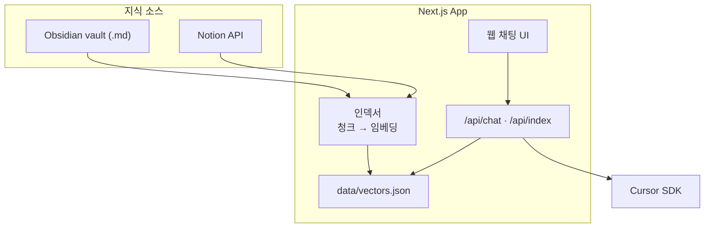
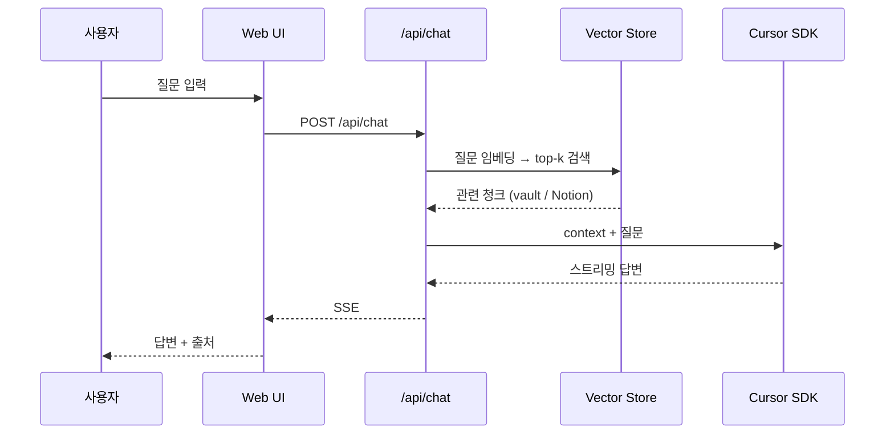

# Company Chat Bot

Obsidian vault + **Notion** 기반 RAG 회사 전용 챗봇.

회사 문서(`.md` vault 또는 Notion)를 인덱싱하고, 웹 UI에서 질문하면 관련 내용을 검색한 뒤 **Cursor SDK**로 답변을 생성합니다.

> **현재 단계:** MVP (로그인 없음, 로컬 실행)  
> **목표:** 전 직원 링크 공개 → 2차: 배포 + 웍스 SSO

---

## 빠른 시작

```bash
npm install
cp .env.example .env.local
# .env.local 편집 (아래 필수 항목 참고)
npm run dev
```

1. `http://localhost:3000` 접속
2. **Re-index** 클릭
3. 채팅 테스트

### 필수 설정

| 변수 | 필수 | 설명 |
|------|------|------|
| `CURSOR_API_KEY` | ✅ | [Cursor Settings](https://cursor.com/settings) → API Keys. **답변 생성 과금 = Cursor 구독 크레딧** |
| `VAULT_PATH` | 택1 | Obsidian vault / Git 레포 절대 경로 |
| `NOTION_PAGE_IDS` | 택1 | 회사 문서 **루트 페이지** URL 또는 ID (하위 페이지 자동 수집) |
| `NOTION_API_KEY` | Notion 사용 시 | [Notion Integrations](https://www.notion.so/profile/integrations) → Internal Integration **Secret** (`secret_...`) |

`VAULT_PATH` 또는 `NOTION_PAGE_IDS` 중 **하나 이상** 필요. 둘 다 설정하면 **합쳐서** 인덱싱.

---

## 아키텍처



| 영역 | 기술 |
|------|------|
| Framework | Next.js 16 (App Router) |
| 지식 소스 | Obsidian vault (`.md`) + Notion 페이지 |
| 검색 | RAG — 로컬 임베딩 (`Xenova/all-MiniLM-L6-v2`) + JSON 벡터 스토어 |
| LLM | Cursor SDK (`@cursor/sdk`) |
| UI | 웹 채팅 (SSE 스트리밍) |

---

## RAG 플로우



**인덱싱(Re-index)** = DB 인덱스 rebuild와 같은 개념. vault/Notion 문서를 읽어 `data/vectors.json`에 검색용 벡터를 저장합니다.

- 첫 실행: 임베딩 모델 다운로드로 **1~3분** 추가
- vault 범위가 크면 오래 걸림 (예: `Documents` 전체 → 수십 분~). **회사 문서 폴더만** 또는 **Notion 루트 1페이지** 권장

---

## Notion 연동

### 1. Integration 생성

1. [notion.so/profile/integrations](https://www.notion.so/profile/integrations) → **New integration**
2. 회사 워크스페이스 선택 → **Internal Integration Secret** 복사
3. `.env.local` → `NOTION_API_KEY=secret_...`

> Secret = API 액세스 토큰. Notion **문서 읽기**용 (Cursor 과금과 무관).

### 2. 페이지 연결 (필수)

Integration만 만들면 API 접근 불가. **읽을 페이지마다** 연결 필요:

1. 회사 문서 **허브 페이지** (뭉탱이) 열기
2. **⋯** → **연결** → integration 선택

### 3. 루트 페이지 ID

회사 문서를 모아둔 **상위 페이지 URL 하나**면 충분합니다. 하위 페이지·DB·링크된 페이지는 **재귀 인덱싱**됩니다.

```bash
NOTION_PAGE_IDS=https://www.notion.so/your-workspace/회사문서-xxxx
```

---

## Obsidian vault 연동

1. Obsidian → **다른 vault 열기** → 회사 문서 폴더 선택
2. Finder에서 vault 경로 확인
3. `.env.local`:

```bash
VAULT_PATH=/Users/you/Documents/company-wiki
```

> `Documents` 전체를 vault로 쓰면 `.md` 수천 개 → 인덱싱 매우 느림. **하위 폴더 하나** 권장.

---

## 환경변수 전체

```bash
# 지식 소스 (택1 이상)
VAULT_PATH=/path/to/vault
NOTION_API_KEY=secret_...
NOTION_PAGE_IDS=https://notion.so/...

# LLM (필수)
CURSOR_API_KEY=cursor_...
CURSOR_MODEL=composer-2.5

# RAG (선택)
RAG_TOP_K=5
INDEX_INCLUDE=**/*.md
EMBEDDING_MODEL=local
```

`.env.local`은 **Git에 커밋하지 마세요.**

---

## API

| Endpoint | Method | 설명 |
|----------|--------|------|
| `/api/chat` | POST | `{ message, history? }` → RAG + Cursor SDK 스트리밍 |
| `/api/index` | POST | vault + Notion 재인덱싱 |
| `/api/health` | GET | 설정·인덱스 상태 (`chunkCount`, `indexedAt`) |

---

## 프로젝트 구조

```
obsidian_chat_bot/
├── app/
│   ├── page.tsx
│   └── api/
│       ├── chat/route.ts
│       ├── index/route.ts
│       └── health/route.ts
├── lib/
│   ├── indexer/          # vault + Notion 통합 인덱싱
│   ├── notion/           # Notion API
│   ├── embeddings/       # 로컬 임베딩
│   ├── vector-store/     # 벡터 검색
│   ├── rag/              # retrieve + prompt
│   └── llm/              # Cursor SDK
├── components/chat/
├── data/                 # vectors.json (gitignore)
├── .env.example
└── .env.local            # gitignore
```

---

## MVP vs 2차

### MVP (현재)

- 웹 채팅 UI
- Obsidian vault + Notion 인덱싱
- RAG + Cursor SDK 답변 + 출처 표시
- 수동 Re-index
- 로그인 없음 · localhost

### 2차

- Vercel/사내 서버 **배포** → 전 직원 URL
- **웍스 SSO** 로그인
- 자동 재인덱싱 (Git hook / cron)
- Slack, Obsidian 플러그인
- 코드 파일 인덱싱, 부서별 권한

---

## 과금 정리

| 항목 | 과금 |
|------|------|
| Notion API (문서 읽기) | Notion 플랜 범위, Cursor 과금 **아님** |
| Cursor SDK (답변 생성) | **Cursor 구독 크레딧** |
| 로컬 임베딩 | 무료 (모델 다운로드 1회) |

---

## 보안

| 커밋 금지 | 이유 |
|-----------|------|
| `.env.local` | API 키, vault 경로 |
| `data/` | 회사 문서 임베딩 |
| Notion/Cursor Secret | 유출 시 API 남용 |

---

## License

TBD
