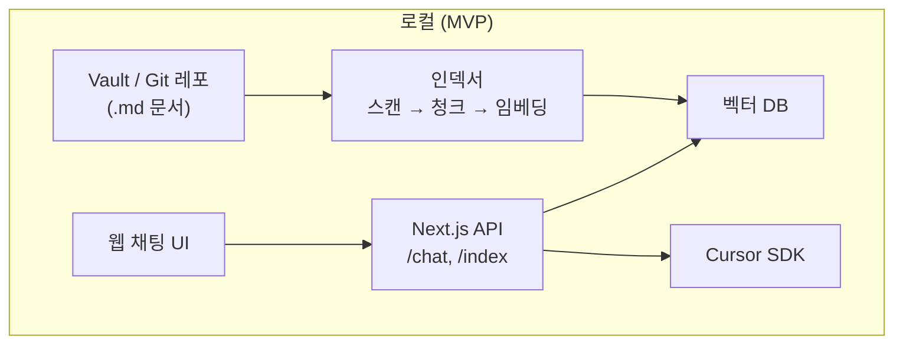
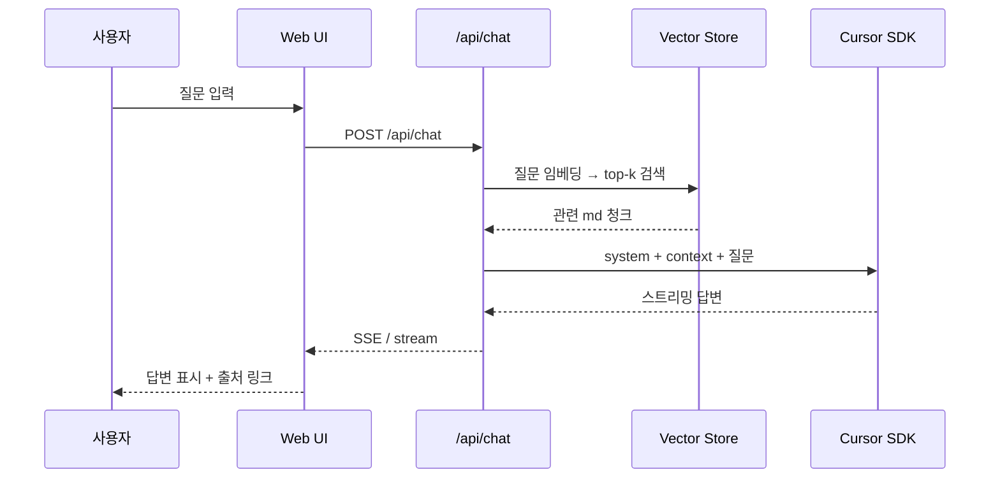

# Obsidian Chat Bot

Obsidian vault 기반 RAG(Retrieval-Augmented Generation) 회사 전용 챗봇.

로컬 `Documents` 하위 vault/레포의 마크다운을 인덱싱하고, 웹 UI에서 질문하면 관련 문서를 검색한 뒤 **Cursor SDK**로 답변을 생성합니다.

> **현재 단계:** MVP 설계 · README 정리  
> **목표:** 개인 로컬 MVP → 회사 내부 배포 확장

---

## 아키텍처



| 영역 | 기술 |
|------|------|
| Framework | Next.js (App Router) 풀스택 |
| 지식 소스 | Obsidian vault / Git 레포 (`.md`) |
| 검색 | RAG (임베딩 + 벡터 DB) |
| LLM | Cursor SDK (Cursor 구독 크레딧) |
| UI | 웹 채팅 |

---

## RAG 플로우



1. vault의 `.md` 파일을 스캔하고 청크 단위로 분할
2. 각 청크를 임베딩하여 벡터 DB에 저장
3. 사용자 질문과 유사한 top-k 청크를 검색
4. 검색 결과를 프롬프트 context로 조립
5. Cursor SDK로 답변 생성 (스트리밍)
6. UI에 답변 + **출처 노트 경로** 표시

---

## 프로젝트 구조 (예정)

```
obsidian_chat_bot/
├── app/
│   ├── page.tsx              # 채팅 UI
│   ├── api/
│   │   ├── chat/route.ts     # RAG + Cursor SDK
│   │   └── index/route.ts    # 재인덱싱 트리거
│   └── layout.tsx
├── lib/
│   ├── indexer/              # vault 스캔, 청킹
│   ├── embeddings/           # 임베딩 생성
│   ├── vector-store/         # 유사도 검색
│   ├── rag/                  # retrieve + prompt 조립
│   └── llm/                  # Cursor SDK 래퍼
├── components/
│   └── chat/                 # 메시지 UI, 입력창
├── data/                     # 벡터 DB (gitignore)
├── .env.local                # 비밀값 (gitignore)
└── .env.example              # 환경변수 템플릿
```

`lib/` 레이어 분리로 MVP 이후 인덱서를 CLI/워커로 분리하기 쉽게 구성합니다.

---

## API (예정)

| Endpoint | Method | 설명 |
|----------|--------|------|
| `/api/chat` | POST | `{ message, history? }` → RAG 검색 → Cursor SDK 스트리밍 응답 |
| `/api/index` | POST | vault 재스캔 → 임베딩 → 벡터 DB 갱신 |
| `/api/health` | GET | 인덱스 상태 (문서 수, 마지막 인덱싱 시각) |

---

## 환경변수

`.env.local`에 설정합니다. **절대 Git에 커밋하지 마세요.**

```bash
VAULT_PATH=/path/to/your/vault      # Obsidian vault 또는 Git 레포 경로
CURSOR_API_KEY=your_cursor_api_key  # Cursor SDK API 키
EMBEDDING_MODEL=local               # MVP: 로컬 임베딩
INDEX_INCLUDE=**/*.md               # 인덱싱 대상 (MVP: md만)
```

`.env.example`을 복사해 사용하세요:

```bash
cp .env.example .env.local
```

---

## MVP vs 2차

### MVP

- Next.js 웹 채팅 UI
- 로컬 vault `.md` 인덱싱
- RAG + Cursor SDK 답변
- 수동/버튼 재인덱싱
- 출처(노트 경로) 표시

### 2차

- 로그인 / 팀 배포
- 코드 파일 (`.ts`, `.py` 등) 인덱싱
- vault 자동 watch / Git hook
- Slack, Obsidian 플러그인
- 부서별 vault / 접근 제어

---

## 보안

README와 설계 문서에는 **아키텍처와 플로우만** 포함합니다. 아래는 Git에 올리지 않습니다.

| 커밋 금지 | 이유 |
|-----------|------|
| `.env.local`, `.env` | API 키, vault 실제 경로 |
| `data/` (벡터 DB) | 회사 문서 임베딩 데이터 |
| vault 원본 / 회사 내부 URL | 민감 정보 |

공개 레포라면 `VAULT_PATH`에 실제 사용자명·회사 경로를 README에 적지 마세요. placeholder만 사용합니다.

---

## 로컬 실행 (구현 후)

```bash
npm install
cp .env.example .env.local
# .env.local 편집 후
npm run dev
```

브라우저에서 `http://localhost:3000` 접속.

---

## License

TBD
