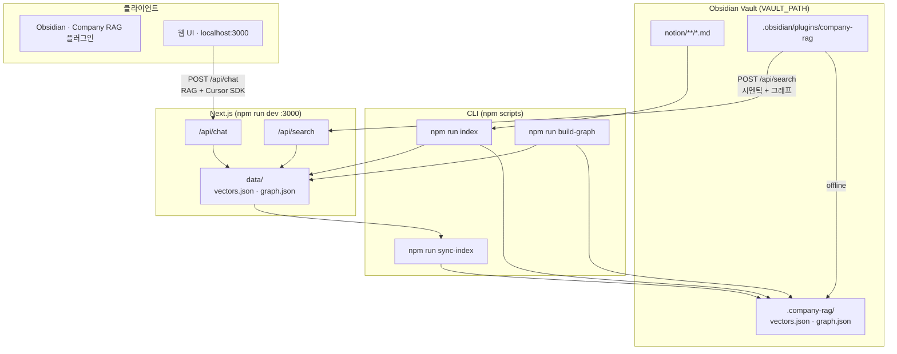

# Obsidian Chat Bot

Obsidian **vault 폴더** 안의 `.md`를 인덱싱해 시멘틱 검색·채팅합니다.

**Company RAG** Obsidian 플러그인까지 연동되어, 앱 안에서 시멘틱 + 그래프 검색을 사용할 수 있습니다.

---

## 구조



| 구성 | 역할 |
|------|------|
| vault `notion/` | 인덱싱 대상 md |
| `npm run index` | md → 임베딩 → `data/` + graph |
| `npm run sync-index` | `data/` → vault `.company-rag/` |
| **Company RAG 플러그인** | Obsidian 사이드바 Lookup · `/api/search` 호출 |
| API offline | 플러그인이 `.company-rag/` 로컬 키워드 + 그래프 fallback |
| 웹 UI | 브라우저 채팅 · `/api/chat` |

---

## Vault 구조

```
{VAULT_PATH}/
├── notion/              # 회사 문서 md (INDEX_INCLUDE 대상)
├── .company-rag/        # npm run sync-index → vectors.json, graph.json
└── .obsidian/plugins/company-rag/   # Obsidian 플러그인
```

---

## 설정

```bash
cp .env.example .env.local
```

| 변수 | 설명 |
|------|------|
| `VAULT_PATH` | Obsidian vault 절대 경로 |
| `INDEX_INCLUDE` | 인덱싱 glob (예: `notion/**/*.md`) |
| `CURSOR_API_KEY` | 웹 채팅용 ([Cursor Settings](https://cursor.com/settings)) |
| `RAG_INDEX_DIR` | vault 내 인덱스 폴더 (기본 `.company-rag`) |

---

## 사용

```bash
npm install

npm run index
npm run build-graph   # [[위키링크]]만 갱신 (임베딩 없음)
npm run sync-index    # .company-rag/ 로 복사

npm run dev           # http://localhost:3000
```

md 추가·수정 후 `npm run index` → `npm run sync-index` 를 다시 실행합니다.

---

## Obsidian 플러그인 (Company RAG)

```bash
cd obsidian-plugin && npm install && npm run build

mkdir -p {VAULT_PATH}/.obsidian/plugins
ln -sf /path/to/obsidian_chat_bot/obsidian-plugin {VAULT_PATH}/.obsidian/plugins/company-rag

npm run sync-index
npm run dev    # 시멘틱 검색 API
```

Obsidian → Community plugins → **Company RAG** ON → 리본 🔍

- 유사도 **%** + **🔗 연결** (wikilink 이웃)
- **노트 열기** → vault md 이동

---

## 커밋 금지

`.env.local`, `data/`, vault 안 회사 문서·인덱스
