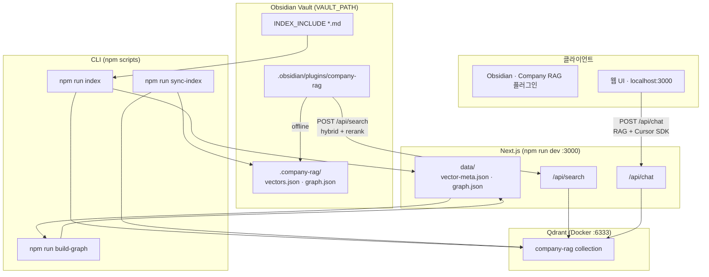
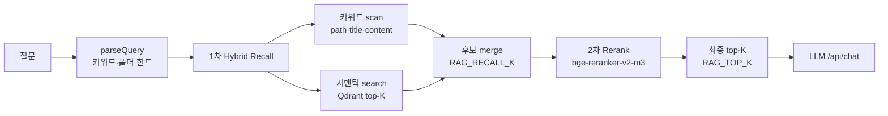

# Obsidian Chat Bot

Obsidian **vault 폴더** (`VAULT_PATH`) 안의 `.md`를 인덱싱해 **hybrid 검색 + rerank + 채팅**합니다.

벡터 저장은 **Qdrant** (로컬 Docker). Obsidian **Company RAG** 플러그인은 `/api/search`로 검색하고, API가 꺼지면 vault `.company-rag/` offline fallback을 씁니다.

**v0.3** — Hybrid 검색(키워드 + 시맨틱) + **BGE rerank** 2단 retrieval. Qdrant payload에 `rootFolder` 포함.

**v0.2** — `vectors.json` 대신 Qdrant Search Engine 패턴 (HNSW cosine top-K).

---

## 구조



### 검색 워크플로우 (v0.3)



| 단계 | 역할 |
|------|------|
| **1차 Hybrid** | 의미(시맨틱) + 정확한 단어(키워드)로 후보 **넓게** 수집 |
| **2차 Rerank** | cross-encoder가 query+청크 쌍을 읽고 **순위 재정렬** |
| **Generation** | rerank된 청크를 context로 Cursor SDK 답변 |

| 구성 | 역할 |
|------|------|
| vault md (`INDEX_INCLUDE`) | 인덱싱 대상 (예: `**/*.md`, `notion/**/*.md`) |
| `npm run index` | md → 임베딩 → **Qdrant** + graph |
| `npm run sync-index` | Qdrant → vault `.company-rag/vectors.json` (offline용) |
| **Company RAG 플러그인** | Obsidian 사이드바 Lookup · `/api/search` 호출 |
| API offline | 플러그인이 `.company-rag/` 로컬 키워드 + 그래프 fallback |
| 웹 UI | 브라우저 채팅 · `/api/chat` |

---

## Vault 구조

```
{VAULT_PATH}/
├── notion/              # 회사 문서 md (INDEX_INCLUDE 대상)
├── .company-rag/        # npm run sync-index → vectors.json, graph.json
└── .obsidian/plugins/company-rag/   # Obsidian 플러그인
```

---

## 설정

```bash
cp .env.example .env.local
```

| 변수 | 설명 |
|------|------|
| `VAULT_PATH` | Obsidian vault 절대 경로 |
| `INDEX_INCLUDE` | 인덱싱 glob (예: `notion/**/*.md`) |
| `CURSOR_API_KEY` | 웹 채팅용 ([Cursor Settings](https://cursor.com/settings)) |
| `RAG_INDEX_DIR` | vault 내 인덱스 폴더 (기본 `.company-rag`) |
| `QDRANT_URL` | Qdrant REST URL (기본 `http://127.0.0.1:6333`) |
| `QDRANT_COLLECTION` | Qdrant 컬렉션 (기본 `company-rag`) |
| `RAG_TOP_K` | rerank **후** LLM·API에 넘길 최종 청크 수 |
| `RAG_RECALL_K` | hybrid **1차** 후보 풀 크기 (기본 `50`) |
| `RERANK_ENABLED` | cross-encoder rerank 사용 (`true` / `false`) |
| `RERANK_MODEL` | rerank ONNX 모델 (기본 `woxpas-ai/bge-reranker-v2-m3-onnx`) |
| `RERANK_BATCH_SIZE` | rerank 배치 크기 (기본 `8`) |

---

## 사용

```bash
npm install

npm run qdrant:up    # Qdrant Docker (최초 1회)
npm run index
npm run build-graph   # [[위키링크]]만 갱신 (임베딩 없음)
npm run sync-index    # .company-rag/ 로 offline 스냅샷 export

npm run dev           # http://localhost:3000
```

md 추가·수정 후 `npm run index` → `npm run sync-index` 를 다시 실행합니다.

### Qdrant (로컬 Docker)

```bash
npm run qdrant:up     # http://127.0.0.1:6333
npm run qdrant:down
```

| 변수 | 기본값 | 설명 |
|------|--------|------|
| `QDRANT_URL` | `http://127.0.0.1:6333` | Qdrant REST API |
| `QDRANT_COLLECTION` | `company-rag` | 컬렉션 이름 |

벡터·청크 본문은 Qdrant에 저장됩니다. `data/vector-meta.json`에는 `indexedAt`, `chunkCount`만 둡니다.

**대시보드:** [http://localhost:6333/dashboard](http://localhost:6333/dashboard) · 컬렉션 `company-rag`

**초기 풀 인덱스**는 로컬 embed(`Xenova`)가 병목입니다. vault 전체(`**/*.md`, 수천 파일)면 **수 시간** 걸릴 수 있습니다. Qdrant upsert는 임베딩이 끝난 뒤 배치로 진행됩니다.

> v0.3 예정: 변경 파일만 재인덱싱 (증분). v0.2는 매번 풀 스캔.

---

## 인덱싱 기준

### 어떤 파일이 대상인가

`{VAULT_PATH}` 아래에서 **`INDEX_INCLUDE` glob**에 맞는 `.md`만 인덱싱합니다.

```bash
# 권장 — 회사 문서만
INDEX_INCLUDE=notion/**/*.md

# vault 전체 (md 수천 개 → 수 시간 걸릴 수 있음)
INDEX_INCLUDE=**/*.md
```

**자동 제외** (`lib/indexer/scan.ts`):

- `node_modules/`, `.git/`, `.obsidian/`, `.trash/`

### 어떻게 잘라서 저장하나 (청킹)

`lib/indexer/chunk.ts`:

| 규칙 | 값 |
|------|-----|
| 섹션 분리 | `#` 제목 단위 |
| 최대 청크 크기 | **800자** |
| 겹침 (overlap) | **120자** |
| 청크 내용 | `# 섹션제목` + 본문 조각 |

파일 1개가 여러 청크가 될 수 있습니다. 검색·유사도는 **파일 단위가 아니라 청크 단위**입니다.

### 무엇이 저장되나

| 출력 | 내용 |
|------|------|
| **Qdrant** `company-rag` | 청크 텍스트 + 임베딩 벡터 + payload (`path`, `title`, `content`, `startLine`, `rootFolder`) |
| `data/vector-meta.json` | 인덱스 메타 (`indexedAt`, `chunkCount`) |
| `graph.json` | 같은 md들의 `[[wikilink]]` 노드·엣지 |

`npm run index`는 **vectors + graph** 둘 다 갱신합니다. `npm run build-graph`는 wikilink 그래프만 다시 빌드합니다.

---

## Obsidian 플러그인 (Company RAG)

```bash
cd obsidian-plugin && npm install && npm run build

mkdir -p {VAULT_PATH}/.obsidian/plugins
ln -sf /path/to/obsidian_chat_bot/obsidian-plugin {VAULT_PATH}/.obsidian/plugins/company-rag

npm run sync-index
npm run dev    # 시멘틱 검색 API
```

Obsidian → Community plugins → **Company RAG** ON → 리본 🔍

- 유사도 **%** + **🔗 연결** (wikilink 이웃)
- **노트 열기** → vault md 이동

---

## 기술 스택

### 앱

| 기술 | 용도 |
|------|------|
| [Next.js 16](https://nextjs.org/) | 웹 UI + API Route (`/api/chat`, `/api/search`) |
| [React 19](https://react.dev/) | 채팅 UI |
| [TypeScript](https://www.typescriptlang.org/) | 앱·플러그인·CLI |
| [Tailwind CSS 4](https://tailwindcss.com/) | 웹 스타일 |
| [SSE](https://developer.mozilla.org/en-US/docs/Web/API/Server-sent_events) | `/api/chat` 스트리밍 답변 |

### RAG (Retrieval-Augmented Generation)

질문 → **hybrid recall** → **rerank** → 관련 md 조각 → LLM에 context로 붙여 답변.

| 단계 | 구현 | 모델 / 저장 |
|------|------|-------------|
| Chunking | `lib/indexer/chunk.ts` | md를 ~800자 청크 (overlap 120) |
| Embedding | `lib/embeddings/local.ts` | **`Xenova/all-MiniLM-L6-v2`** · 384차원 (로컬 bi-encoder) |
| 1차 Hybrid | `lib/rag/query-hints.ts` · `lib/rag/hybrid.ts` | 키워드(path/title/content) + Qdrant 시맨틱 → `RAG_RECALL_K` |
| 2차 Rerank | `lib/rerank/local.ts` | **`BAAI/bge-reranker-v2-m3`** (ONNX: `woxpas-ai/bge-reranker-v2-m3-onnx`) cross-encoder |
| Graph expand | `lib/graph/` · `lib/rag/graph-expand.ts` | rerank **비활성** 시 wikilink 1-hop (기본은 rerank 우선) |
| Generation | `@cursor/sdk` · `CURSOR_MODEL` | context + 질문 → LLM 스트리밍 (기본 `composer-2.5`) |

#### 사용 모델 요약

| 용도 | Hugging Face / 설정 | 비고 |
|------|---------------------|------|
| 인덱싱·시맨틱 검색 | [Xenova/all-MiniLM-L6-v2](https://huggingface.co/Xenova/all-MiniLM-L6-v2) | `@xenova/transformers`, 384-dim cosine |
| Rerank | [BAAI/bge-reranker-v2-m3](https://huggingface.co/BAAI/bge-reranker-v2-m3) | ONNX via `RERANK_MODEL`, query+passage 쌍 scoring |
| 채팅 LLM | Cursor SDK (`CURSOR_MODEL`) | API key 필요 |

> Rerank 모델 **첫 로드** 시 ONNX 가중치 다운로드(~500MB)로 수십 초 걸릴 수 있습니다.

### 저장소

| 저장 | 내용 |
|------|------|
| **Qdrant** (Docker) | 청크 + embedding (시멘틱 검색) |
| `data/vector-meta.json` | 인덱스 메타 |
| `data/graph.json` | wikilink 노드·엣지 |
| `{VAULT_PATH}/.company-rag/vectors.json` | Obsidian offline용 스냅샷 (`sync-index`) |

> Graph DB(Neo4j) 없음. wikilink는 `graph.json` 파일로 유지.

### Obsidian 플러그인

| 기술 | 용도 |
|------|------|
| [Obsidian API](https://docs.obsidian.md/) | Company RAG Lookup 사이드바 |
| esbuild | 플러그인 번들 (`main.js`) |
| `requestUrl` | `POST /api/search` (offline → 로컬 키워드 fallback) |

### CLI · 기타

| 명령 / 라이브러리 | 용도 |
|-------------------|------|
| `tsx` | `index` · `sync-index` · `build-graph` CLI |
| `glob` | vault md 스캔 (`INDEX_INCLUDE`) |
| `@qdrant/js-client-rest` | Qdrant REST 클라이언트 |
| `docker compose` | 로컬 Qdrant (`npm run qdrant:up`) |
| `@notionhq/client` | `npm run notion:export` (선택) |

---

## Qdrant 비용 (참고)

| 방식 | 비용 |
|------|------|
| **로컬 Docker (현재)** | Qdrant OSS **$0** — 맥 디스크·전기만 |
| [Qdrant Cloud Free](https://cloud.qdrant.io/) | 1 GB RAM · 4 GB disk · **$0** (inactivity suspend 주의) |
| Cloud Starter+ | ~$35/월~ (팀 prod) |

---

## 커밋 금지

`.env.local`, `data/`, vault 안 회사 문서·인덱스
