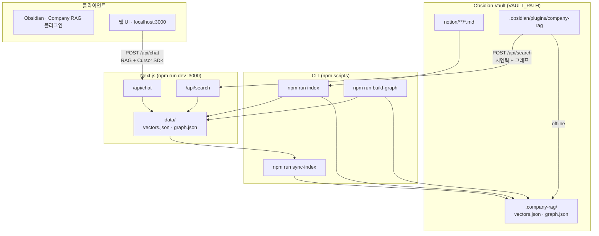

# Obsidian Chat Bot

Obsidian **vault 폴더** 안의 `.md`를 인덱싱해 시멘틱 검색·채팅합니다.

**Company RAG** Obsidian 플러그인까지 연동되어, 앱 안에서 시멘틱 + 그래프 검색을 사용할 수 있습니다.

---

## 구조



| 구성 | 역할 |
|------|------|
| vault `notion/` | 인덱싱 대상 md |
| `npm run index` | md → 임베딩 → `data/` + graph |
| `npm run sync-index` | `data/` → vault `.company-rag/` |
| **Company RAG 플러그인** | Obsidian 사이드바 Lookup · `/api/search` 호출 |
| API offline | 플러그인이 `.company-rag/` 로컬 키워드 + 그래프 fallback |
| 웹 UI | 브라우저 채팅 · `/api/chat` |

---

## Vault 구조

```
{VAULT_PATH}/
├── notion/              # 회사 문서 md (INDEX_INCLUDE 대상)
├── .company-rag/        # npm run sync-index → vectors.json, graph.json
└── .obsidian/plugins/company-rag/   # Obsidian 플러그인
```

---

## 설정

```bash
cp .env.example .env.local
```

| 변수 | 설명 |
|------|------|
| `VAULT_PATH` | Obsidian vault 절대 경로 |
| `INDEX_INCLUDE` | 인덱싱 glob (예: `notion/**/*.md`) |
| `CURSOR_API_KEY` | 웹 채팅용 ([Cursor Settings](https://cursor.com/settings)) |
| `RAG_INDEX_DIR` | vault 내 인덱스 폴더 (기본 `.company-rag`) |

---

## 사용

```bash
npm install

npm run index
npm run build-graph   # [[위키링크]]만 갱신 (임베딩 없음)
npm run sync-index    # .company-rag/ 로 복사

npm run dev           # http://localhost:3000
```

md 추가·수정 후 `npm run index` → `npm run sync-index` 를 다시 실행합니다.

---

## 인덱싱 기준

### 어떤 파일이 대상인가

`{VAULT_PATH}` 아래에서 **`INDEX_INCLUDE` glob**에 맞는 `.md`만 인덱싱합니다.

```bash
# 권장 — 회사 문서만
INDEX_INCLUDE=notion/**/*.md

# vault 전체 (md 수천 개 → 수 시간 걸릴 수 있음)
INDEX_INCLUDE=**/*.md
```

**자동 제외** (`lib/indexer/scan.ts`):

- `node_modules/`, `.git/`, `.obsidian/`, `.trash/`

### 어떻게 잘라서 저장하나 (청킹)

`lib/indexer/chunk.ts`:

| 규칙 | 값 |
|------|-----|
| 섹션 분리 | `#` 제목 단위 |
| 최대 청크 크기 | **800자** |
| 겹침 (overlap) | **120자** |
| 청크 내용 | `# 섹션제목` + 본문 조각 |

파일 1개가 여러 청크가 될 수 있습니다. 검색·유사도는 **파일 단위가 아니라 청크 단위**입니다.

### 무엇이 저장되나

| 출력 | 내용 |
|------|------|
| `vectors.json` | 청크 텍스트 + 임베딩 벡터 (`all-MiniLM-L6-v2`) |
| `graph.json` | 같은 md들의 `[[wikilink]]` 노드·엣지 |

`npm run index`는 **vectors + graph** 둘 다 갱신합니다. `npm run build-graph`는 wikilink 그래프만 다시 빌드합니다.

---

## Obsidian 플러그인 (Company RAG)

```bash
cd obsidian-plugin && npm install && npm run build

mkdir -p {VAULT_PATH}/.obsidian/plugins
ln -sf /path/to/obsidian_chat_bot/obsidian-plugin {VAULT_PATH}/.obsidian/plugins/company-rag

npm run sync-index
npm run dev    # 시멘틱 검색 API
```

Obsidian → Community plugins → **Company RAG** ON → 리본 🔍

- 유사도 **%** + **🔗 연결** (wikilink 이웃)
- **노트 열기** → vault md 이동

---

## 기술 스택

### 앱

| 기술 | 용도 |
|------|------|
| [Next.js 16](https://nextjs.org/) | 웹 UI + API Route (`/api/chat`, `/api/search`) |
| [React 19](https://react.dev/) | 채팅 UI |
| [TypeScript](https://www.typescriptlang.org/) | 앱·플러그인·CLI |
| [Tailwind CSS 4](https://tailwindcss.com/) | 웹 스타일 |
| [SSE](https://developer.mozilla.org/en-US/docs/Web/API/Server-sent_events) | `/api/chat` 스트리밍 답변 |

### RAG (Retrieval-Augmented Generation)

질문 → 관련 md 조각 검색 → LLM에 context로 붙여 답변.

| 단계 | 구현 | 설명 |
|------|------|------|
| Chunking | `lib/indexer/chunk.ts` | md를 ~800자 청크로 분할 (overlap 120) |
| Embedding | `@xenova/transformers` · `all-MiniLM-L6-v2` | 청크·질문을 384차원 벡터로 변환 (로컬) |
| Retrieval | `lib/vector-store/store.ts` | cosine similarity top-K |
| Graph expand | `lib/graph/` · `lib/rag/graph-expand.ts` | `[[wikilink]]` 1-hop 이웃 추가 |
| Generation | `@cursor/sdk` · `composer-2.5` | context + 질문 → LLM 스트리밍 |

### 저장소 (벡터 DB / Graph DB 대신 JSON)

| 파일 | 내용 |
|------|------|
| `data/vectors.json` | 청크 + embedding 배열 |
| `data/graph.json` | wikilink 노드·엣지 |
| `{VAULT_PATH}/.company-rag/` | Obsidian 플러그인용 복사본 |

> Pinecone·Neo4j 등 별도 DB 없음. 로컬 MVP용 **JSON + 메모리 brute-force 검색**.

### Obsidian 플러그인

| 기술 | 용도 |
|------|------|
| [Obsidian API](https://docs.obsidian.md/) | Company RAG Lookup 사이드바 |
| esbuild | 플러그인 번들 (`main.js`) |
| `requestUrl` | `POST /api/search` (offline → 로컬 키워드 fallback) |

### CLI · 기타

| 명령 / 라이브러리 | 용도 |
|-------------------|------|
| `tsx` | `index` · `sync-index` · `build-graph` CLI |
| `glob` | vault md 스캔 (`INDEX_INCLUDE`) |
| `@notionhq/client` | `npm run notion:export` (선택) |

---

## 커밋 금지

`.env.local`, `data/`, vault 안 회사 문서·인덱스
