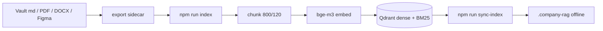
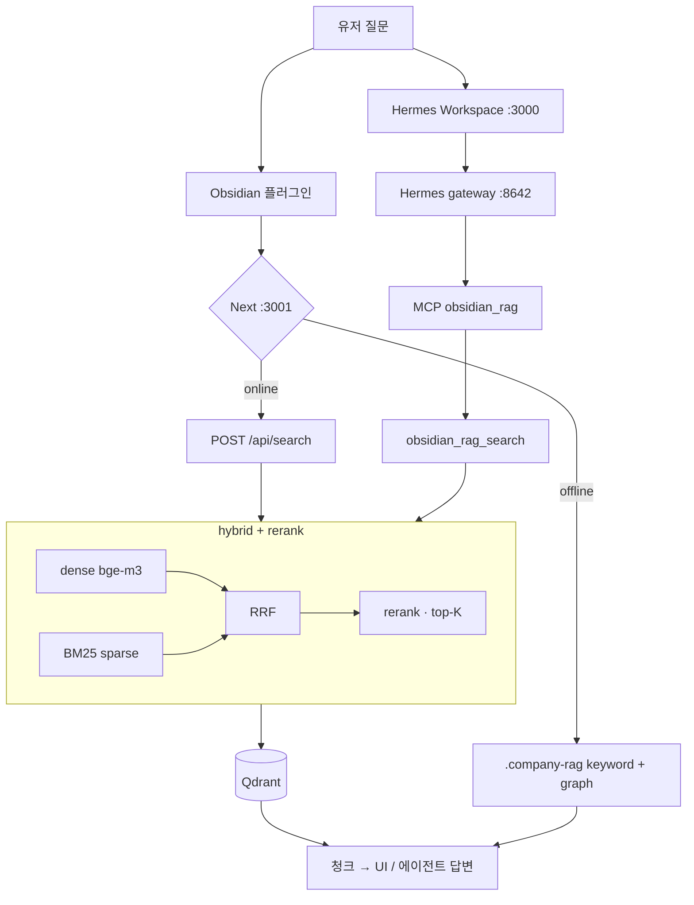

# Obsidian Chat Bot

Obsidian vault(`.md`)을 **hybrid 검색(dense + BM25 → RRF) + rerank**로 인덱싱하고, Hermes Workspace / Obsidian 플러그인 / MCP로 질의합니다.

벡터 저장: **Qdrant** (Docker). 임베딩: **Xenova/bge-m3** (1024d).

## 구조

| 구성 | 역할 | 포트 |
|---|---|---|
| Qdrant | 벡터 DB | `:6333` |
| Next.js API | `/api/search` (Obsidian 플러그인) · `/api/health` | `:3001` |
| Hermes gateway | 에이전트 + MCP | `:8642` |
| Hermes Workspace | 메인 채팅 UI | `:3000` |
| Company RAG 플러그인 | Obsidian 사이드바 검색 | — |

인덱싱은 CLI(`npm run index`). 검색 시 vault md를 다시 읽지 않고 Qdrant(또는 offline `.company-rag/`)에서 청크를 꺼냅니다.

## 빠른 시작

```bash
cp .env.example .env.local   # VAULT_PATH, INDEX_INCLUDE 설정
npm install
npm run qdrant:up
npm run index                # 증분 (전체: npm run index -- --full)
npm run sync-index           # Obsidian offline용 .company-rag/ 스냅샷

# 채팅 UI (Hermes)
npm run hermes:setup         # 최초 1회
npm run workspace:setup      # 최초 1회
npm run hermes:gateway       # :8642
npm run hermes:dashboard     # :9119
npm run workspace:dev        # :3000

# Obsidian 플러그인용 검색 API
npm run dev                  # :3001  → POST /api/search
```

상세 Hermes 연동: [`hermes/WORKSPACE.md`](hermes/WORKSPACE.md)

## 인덱싱 / export

| 명령 | 역할 |
|---|---|
| `npm run index` | md 청킹 → bge-m3 → Qdrant (증분) |
| `npm run sync-index` | Qdrant → vault `.company-rag/` |
| `npm run pdf:export` | PDF → `.pdf-index/**/*.md` (Java 11+) |
| `npm run docx:export` | DOCX → `.docx-index/**/*.md` (Python venv) |
| `npm run figma:export` | Figma 노드 → `.figma-index/` |
| `npm run mcp` | MCP 서버 (stdio) |

청킹: RecursiveCharacterTextSplitter **800 / overlap 120** (`lib/indexer/chunk.ts`).

## 실행 파이프라인

### 1. 인덱싱 (사전)


```mermaid
flowchart LR
  V[Vault md / PDF / DOCX / Figma] --> X[export sidecar]
  X --> I[npm run index]
  I --> C[chunk 800/120]
  C --> E[bge-m3 embed]
  E --> Q[(Qdrant dense + BM25)]
  Q --> S[npm run sync-index]
  S --> O[.company-rag offline]
```

### 2. 질의 (런타임)


```mermaid
flowchart TD
  U[유저 질문] --> OBS[Obsidian 플러그인]
  U --> WEB[Hermes Workspace :3000]

  OBS --> API{Next :3001}
  API -->|online| S[POST /api/search]
  API -->|offline| OFF[.company-rag keyword + graph]

  WEB --> GW[Hermes gateway :8642]
  GW --> MCP[MCP obsidian_rag]
  MCP --> S2[obsidian_rag_search]

  S --> H
  S2 --> H

  subgraph H[hybrid + rerank]
    D[dense bge-m3] --> RRF[RRF]
    B[BM25 sparse] --> RRF
    RRF --> RR[rerank · top-K]
  end

  H --> Q[(Qdrant)]
  Q --> OUT[청크 → UI / 에이전트 답변]
  OFF --> OUT
```

## Obsidian 플러그인

```bash
cd obsidian-plugin && npm install && npm run build
# vault .obsidian/plugins/company-rag 로 링크 후 활성화
npm run sync-index && npm run dev
```

## 주요 env

| 변수 | 설명 |
|---|---|
| `VAULT_PATH` | Obsidian vault 절대 경로 |
| `INDEX_INCLUDE` | vault 루트 기준 glob (예: `**/*.md`) |
| `QDRANT_URL` | 기본 `http://127.0.0.1:6333` |
| `RAG_TOP_K` / `RAG_RECALL_K` | 최종 / 1차 후보 수 |
| `RERANK_ENABLED` | cross-encoder rerank |
| `HERMES_API_KEY` | Workspace ↔ gateway |

전체 목록은 `.env.example` 참고.

## 커밋 금지

`.env.local`, `data/`, vault 안 회사 문서·인덱스
